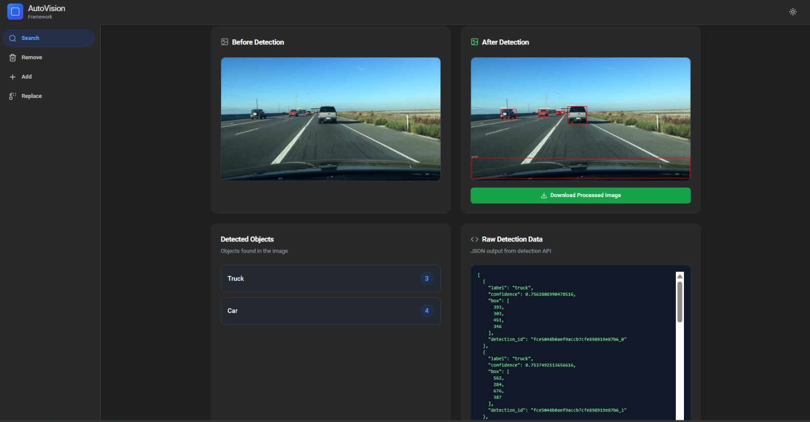

# AutoVision: AI-Powered Image Editing Framework

<div align="center">

 
 
 
 


**A state-of-the-art web application combining YOLOv8, Stable Diffusion 3, and OpenCV for intelligent AI-powered image editing.**

[Features](#-key-features) • [Demo](#-demo) • [Installation](#-quick-start) • [Usage](#-usage) • [Architecture](#️-architecture)

</div>

---

## 🎯 Overview

**AutoVision** is an advanced AI-powered image editing platform that enables users to perform intelligent object manipulation through an intuitive web interface. Leveraging cutting-edge computer vision and generative AI models, AutoVision provides professional-grade image editing capabilities including object detection, removal, addition, replacement, and scene transformation.

### Core Capabilities

- 🔍 **Search & Detect** - Real-time object detection using YOLOv8
- 🗑️ **Remove Objects** - Context-aware object removal with intelligent inpainting
- ➕ **Add Objects** - AI-generated object insertion in specified regions
- 🔄 **Replace Objects** - Smart object replacement with seamless blending
- 🎨 **Color Transform** - Bulk color modification for detected objects
- 🌦️ **Weather Effects** - Scene transformation with weather conditions

---

## 🎬 Demo

### Object Detection & Search

*YOLOv8-powered object detection with bounding boxes and classification*

### Object Addition
.jpg)
*AI-generated object insertion with natural scene integration*

### Object Removal
.jpg)
*AI-generated Object Removal with natural Scene Integration*

### Object Replacement
.jpg)
*Intelligent object replacement using Stable Diffusion 3*

---

## 🏗️ Architecture

AutoVision follows a modern **client-server architecture** with AI models running on GPU-accelerated backend:

```
┌─────────────────────────────────────────────────────────────┐
│                     FRONTEND (React + Vite)                 │
│  ┌──────────┐  ┌──────────┐  ┌──────────┐  ┌──────────┐   │
│  │  Search  │  │  Remove  │  │   Add    │  │ Replace  │   │
│  │   Tab    │  │   Tab    │  │   Tab    │  │   Tab    │   │
│  └──────────┘  └──────────┘  └──────────┘  └──────────┘   │
│       │            │              │              │          │
│       └────────────┴──────────────┴──────────────┘          │
│                         │                                   │
│                    HTTP/REST API                            │
└─────────────────────────┼───────────────────────────────────┘
                          │
                          ▼
┌─────────────────────────────────────────────────────────────┐
│              BACKEND (FastAPI + Python)                     │
│  ┌──────────────────────────────────────────────────────┐  │
│  │              API Endpoints Layer                     │  │
│  │  /search | /remove/apply | /add/apply | /replace    │  │
│  └────────────────────┬─────────────────────────────────┘  │
│                       │                                     │
│  ┌────────────────────▼─────────────────────────────────┐  │
│  │           Detection Cache & State Manager           │  │
│  │        (MD5 hashing for duplicate prevention)       │  │
│  └────────────────────┬─────────────────────────────────┘  │
│                       │                                     │
│         ┌─────────────┴─────────────┐                      │
│         ▼                           ▼                       │
│  ┌─────────────┐            ┌──────────────┐              │
│  │   YOLOv8    │            │   Stable     │              │
│  │  Detection  │            │ Diffusion 3  │              │
│  │   Engine    │            │  Inpainting  │              │
│  └─────────────┘            └──────────────┘              │
│         │                           │                       │
│         └─────────┬─────────────────┘                      │
│                   ▼                                         │
│  ┌─────────────────────────────────────────────────────┐  │
│  │     Image Processing Pipeline (OpenCV + PIL)        │  │
│  │  • Mask generation  • Blending  • Quality scoring   │  │
│  └─────────────────────────────────────────────────────┘  │
└─────────────────────────────────────────────────────────────┘
                          │
                          ▼
                   Google Colab GPU
                   (T4/L4/A100)
```

### System Flow

1. **User Request** → Frontend sends image + parameters to backend
2. **Detection** → YOLOv8 identifies objects, caches results
3. **Processing** → Based on operation:
   - **Remove**: SD3 inpaints masked region
   - **Add**: SD3 generates object in bbox
   - **Replace**: InstructPix2Pix transforms object
4. **Post-Processing** → OpenCV blends, scores quality
5. **Response** → Processed image returned to frontend

### Frontend Stack
- **Framework**: React 18 + TypeScript 5
- **Build Tool**: Vite for lightning-fast development
- **UI Library**: Custom components built with shadcn/ui
- **Styling**: Tailwind CSS for responsive design
- **State Management**: React Context API

### Backend Stack
- **API Framework**: FastAPI (async Python)
- **Object Detection**: YOLOv8 (Medium variant)
- **Generative AI**: Stable Diffusion 3 for inpainting
- **Image Processing**: OpenCV, PIL, NumPy
- **Deployment**: Google Colab + ngrok for GPU access

### AI Models
| Model | Purpose | Source |
|-------|---------|--------|
| YOLOv8m | Object Detection | Ultralytics |
| SD3-Medium | Inpainting/Generation | Stability AI |
| InstructPix2Pix | Object Replacement | timbrooks/HF |

---

## 🚀 Key Features

### 1. **Intelligent Object Removal**
Advanced context-aware removal with multiple quality optimizations:

- **Detection Caching** - Single YOLO pass shared across operations
- **Unique Object IDs** - Hash-based tracking prevents selection errors
- **Adaptive Inpainting** - Size-based parameter optimization:
  - Large objects (>25%): 12% expansion, 55 steps, guidance 9.2
  - Medium objects (8-25%): 18% expansion, 45 steps, guidance 8.6
  - Small objects (<8%): 24% expansion, 38 steps, guidance 8.0
- **Multi-Seed Sampling** - Generates 3-4 candidates, selects best
- **Context-Aware Prompts** - Object-specific background generation
- **Smart Scoring** - Evaluates detail, boundaries, and preservation

### 2. **Precision Object Addition**
Generate new objects with professional quality:
- Draw custom bounding boxes
- Natural language descriptions
- Seamless scene integration
- Multiple generation attempts

### 3. **Seamless Object Replacement**
Replace detected objects while maintaining scene coherence:
- 50% mask expansion for context
- InstructPix2Pix diffusion model
- Preserves lighting and perspective
- Intelligent boundary blending

### 4. **Color Transformation**
Bulk color modification for detected objects:
- Preview matching objects
- Apply color changes to all instances
- Maintains texture and detail

### 5. **Weather Effects**
Transform entire scenes with environmental conditions:
- Snow, Rain, Fog, Sun, Clouds
- Photorealistic transformations
- Preserves scene structure

---

## 📦 Quick Start

### Prerequisites
- Node.js 18+ and npm
- Python 3.9+
- GPU recommended (for backend)

### Frontend Setup

```bash
# Clone repository
git clone https://github.com/aravindg24/road-ai.git
cd road-ai

# Install dependencies
npm install

# Configure API endpoint
echo "VITE_API_URL=http://localhost:8000" > .env

# Start development server
npm run dev
```

### Backend Setup - Local

```bash
cd server

# Install dependencies
pip install -r requirements.txt

# Start FastAPI server
python main.py
```

### Backend Setup - Google Colab (Recommended)

1. Upload `Road_AI_Backend_Colab_FIXED.ipynb` to [Google Colab](https://colab.research.google.com)
2. **Runtime** → Change runtime type → **GPU (T4/L4)**
3. Add your Hugging Face token (Cell 6)
4. Add your ngrok auth token (final cell)
5. Run all cells
6. Copy the ngrok URL and update frontend `.env`:
   ```bash
   VITE_API_URL=https://xxxxx.ngrok-free.app
   ```

---

## 🎨 Usage

### Detect Objects
1. Navigate to **Search** tab
2. Upload image
3. Click **Detect Objects**
4. View annotated results with counts

### Remove Objects
1. Go to **Remove** tab
2. Upload and detect
3. Select target object
4. Click **Remove Object**
5. Download result

### Add Objects
1. Select **Add** tab
2. Upload base image
3. Draw bounding box
4. Enter description (e.g., "blue Tesla Model 3")
5. Generate

### Replace Objects
1. Open **Replace** tab
2. Detect objects
3. Select object to replace
4. Provide replacement description
5. Process

---

## 📊 Performance

### API Endpoints
```
GET  /                      Health check
POST /search                Object detection
POST /remove/apply          Object removal
POST /add/apply            Object addition
POST /replace/apply         Object replacement
POST /replace/detect        Detection for replacement
POST /edit/color-detect     Color match preview
POST /edit/color-change     Bulk color transform
POST /edit/transform        Weather effects
```

### Optimization Details
- **Detection Cache**: MD5-based image hashing prevents duplicate YOLO runs
- **Memory Efficient**: Reuses cached detections across tabs
- **Graceful Fallback**: OpenCV inpainting when SD3 fails
- **CORS Enabled**: Cross-origin request support

---

## 🔧 Configuration

### Environment Variables

```bash
# Frontend (.env)
VITE_API_URL=https://your-ngrok-url.ngrok-free.app

# Backend (Colab/Local - optional)
HF_TOKEN=hf_xxxxxxxxxxxxx
NGROK_AUTH=xxxxxxxxxxxxx
```

### Model Configuration
```python
# YOLOv8 Detection
confidence_threshold = 0.25
iou_threshold = 0.45

# Stable Diffusion 3
num_inference_steps = 38-55  # Adaptive
guidance_scale = 8.0-9.2     # Size-based
strength = 0.65-0.82         # Mask-dependent
```

---

## 📁 Project Structure

```
road-ai/
├── src/
│   ├── components/
│   │   ├── tabs/          # Search, Remove, Add, Replace
│   │   ├── layout/        # Header, Sidebar
│   │   └── ui/            # shadcn components
│   ├── contexts/          # Theme management
│   ├── lib/               # Utilities
│   └── App.tsx
├── server/
│   ├── main.py            # FastAPI backend
│   └── requirements.txt
├── Road_AI_Backend_Colab_FIXED.ipynb
├── package.json
└── vite.config.ts
```

---

## 🐛 Known Limitations

- **GPU Memory**: Large images require >8GB VRAM
- **Processing Time**: SD3 inference 10-30s per operation
- **Colab Sessions**: Free tier ~12hr limit
- **Prompt Length**: Keep descriptions <60 tokens (CLIP limit)
- **ngrok URL**: Regenerate after Colab restart

---

## 🚀 Deployment

### Frontend (Vercel/Netlify)
```bash
npm run build
vercel --prod  # or netlify deploy --prod --dir=dist
```

### Backend Options
- **Recommended**: Google Colab + ngrok (free GPU)
- **AWS EC2**: G4dn instances with GPU
- **Hugging Face Spaces**: Gradio deployment

---

## 🎓 Technical Highlights

### Innovations
✅ Single-detection architecture with caching  
✅ Context-aware inpainting prompts  
✅ Adaptive parameter scheduling  
✅ Multi-seed quality scoring  
✅ Position-aware background filling  
✅ Hybrid SD3 + OpenCV pipeline  

### Bug Fixes
✅ Detection ID mismatch resolved  
✅ Boolean indexing error fixed  
✅ YOLO duplicate calls eliminated  
✅ Mask expansion optimization  
✅ Robust error handling  

---

## 🙏 Acknowledgments

- [Ultralytics](https://ultralytics.com/) - YOLOv8 object detection
- [Stability AI](https://stability.ai/) - Stable Diffusion 3
- [Hugging Face](https://huggingface.co/) - Model hosting & diffusers
- [FastAPI](https://fastapi.tiangolo.com/) - Backend framework
- [shadcn/ui](https://ui.shadcn.com/) - UI components

---

## 📄 License

MIT License - See [LICENSE](LICENSE) for details.

---

## 📞 Contact

For questions, issues, or contributions, please open an issue on GitHub.

---

<div align="center">

**Built with ❤️ using React, TypeScript, FastAPI, YOLOv8, and Stable Diffusion**

⭐ Star this repo if you find it helpful!

</div>


[def]: #-architecture
